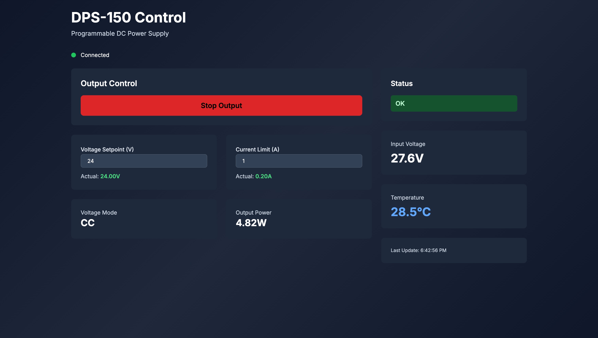

# FNIRSI DPS-150 Remote Control

A web-based remote control interface for the [FNIRSI DPS-150](https://www.fnirsi.com/products/dps-150) programmable DC power supply. This project provides a modern, real-time web UI to control and monitor your power supply over USB, compiled into a standalone executable with no dependencies.

Inspired by [@cho45/fnirsi-dps-150](https://github.com/cho45/fnirsi-dps-150] which connect to the DPS-150 directly over [WebSerial](https://developer.mozilla.org/en-US/docs/Web/API/Web_Serial_API). Unfortunately, that design makes it un-usuable in a remote control type of scenario. So I built this so that you can run this on a little RaspberryPi on your bench and monitor it remotely. 



## Requirements

- Deno (v1.42+ recommended)
- FNIRSI DPS-150 Power Supply connected via USB

## Quick Start

### Development Mode

```sh
deno task dev
```

Serves at `http://localhost:8000` by default. Override with `--port <number>`:

```sh
deno task dev -- --port 8080
```

### Build Standalone Binary

```sh
deno task build
```

The binary is written to `bin/server`. Run it with an optional port override:

```sh
./bin/server --port 8080
```

### Cross-Platform Builds

Build for specific platforms:

```sh
deno task build:macos-intel    # macOS (Intel x86_64)
deno task build:macos-arm      # macOS (Apple Silicon ARM64)
deno task build:linux          # Linux (x86_64)
deno task build:linux-arm      # Linux (ARM)
deno task build:windows        # Windows (x86_64)
```

Build for all platforms at once:

```sh
deno task build:all
```

Binaries will be written to:

- `bin/server-macos-intel` - macOS Intel
- `bin/server-macos-arm` - macOS Apple Silicon
- `bin/server-linux` - Linux
- `bin/server-windows.exe` - Windows

The compiled binary includes:

- Complete web UI (HTML, CSS, JavaScript)
- WebSocket server
- DPS-150 protocol implementation
- Serial port communication

No external files or dependencies needed at runtime!

### Manual Serial Port Configuration

If auto-detection fails or you need to specify a particular port:

```bash
# Linux/macOS
SERIAL_PORT=/dev/ttyUSB0 ./bin/server --port 8080

# Windows (PowerShell)
$env:SERIAL_PORT="COM3"; .\bin\server.exe --port 8080

# Windows (Command Prompt)
set SERIAL_PORT=COM3 && bin\server.exe --port 8080
```

## Credits

This project was inspired by and builds upon the excellent work of:

- **[@cho45/fnirsi-dps-150](https://github.com/cho45/fnirsi-dps-150)** - Original protocol
  reverse-engineering and reference implementation

The protocol documentation and reference JavaScript implementation provided the foundation for this
remote control interface.

A significant amount of the code was written using AI Agents.

## License

See LICENSE file for details.
